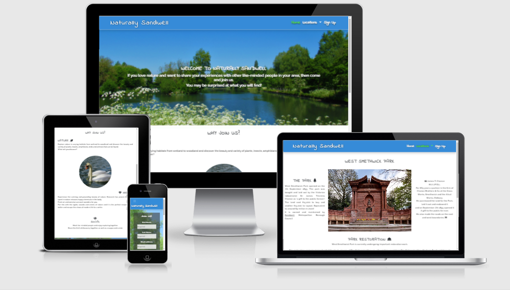
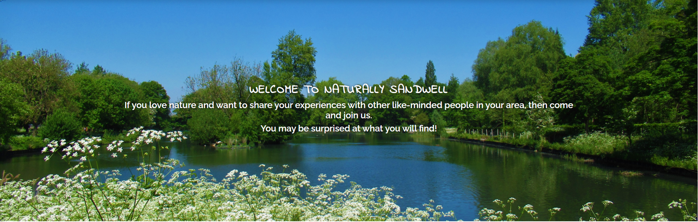
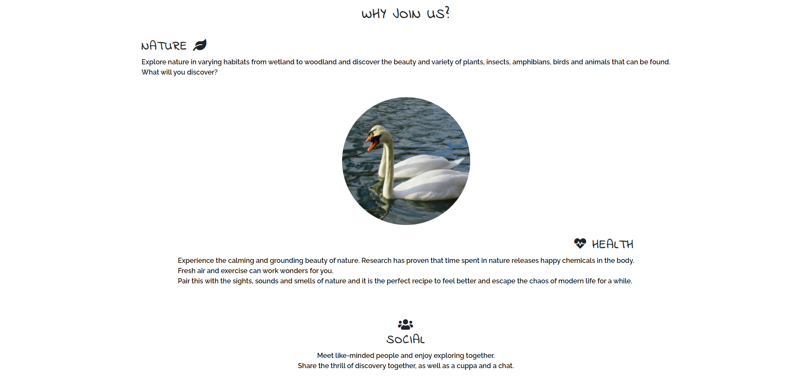
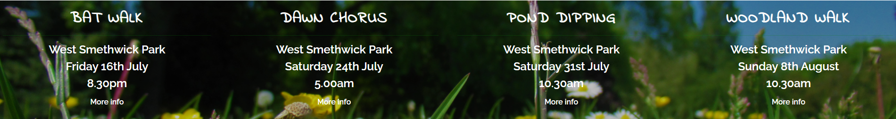
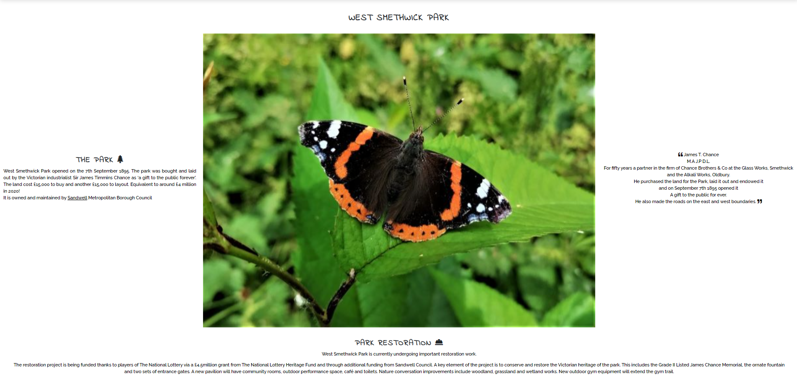
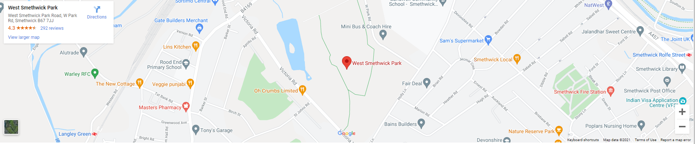
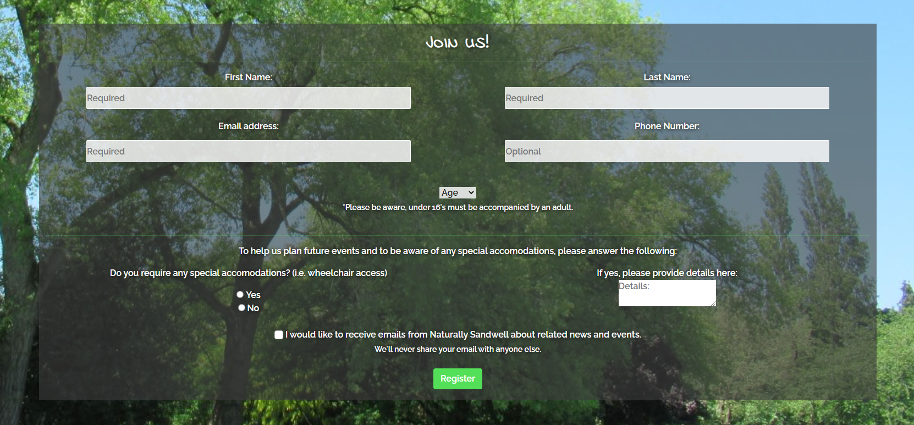
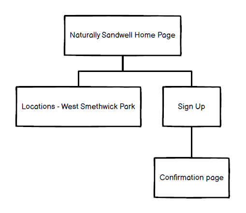
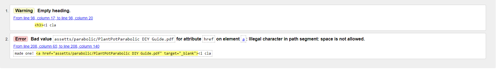
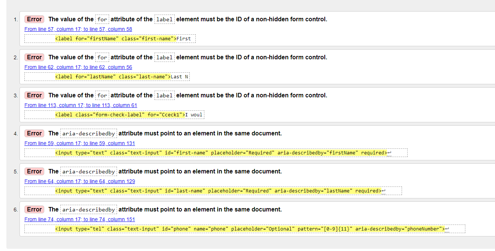

# **Naturally Sandwell**

This site is for like minded people who live in or around Sandwell, a part of *The Black Country* in the West Midlands, who love nature and wish to share their wildlife experiences with others in the local area. This site is designed to help fuel that passion by providing information to users about the wildlife that can be spotted near them and provide socialising opportunities with information about nature walks that they can join in with.

## **User Stories**

### **Home Page**
* I want to see what the group is about and easily find out when and where I can participate in activities. 
* Also to see what type of activities are available and who they are suitable for (i.e. age, accessibility)

### **Locations Page**
* I want to find out about a particular location; where it is/how can I get there and what can I expect to find there.

### **Sign Up Page**
* I want to be able to register to join the group and meet up with other nature lovers in my local area.

## **Features**

### **Existing Features**

* *Navigation Bar*
    * to contain the group logo and navigation bar which is to be the same on all pages in order to give a smooth user experience which links easily between all pages of the site.

* *Landing Page Image*
    * a 'hero image' with information, as a text overlay, which will be a brief introduction to the group.

* *About Us*
    * this section will give the user three benefits of joining the group, split into:
        * Nature
        * Health
        * Social

* *Meet Up*
    * this section will provide details about upcoming events including location, date and time
    * each item will link to further information in the form of a pop-up (modal) which will also include links to external sites
    * to be kept updated with new and upcoming events

* *Footer*
    * to provide social media links; the same on all pages to give a smooth user experience

* *Locations*
    * to show images of the location (using a carousel)
    * this section is to provide information about the location including link(s) to external sites for further info.

* *Map*
    * the use of a Google map to show precise location which links externally to Google Maps so the user can find directions

* *Sign up page*
    * form to register - to include full name and email as required elements - phone number as optional element
    * additional section to the form to gain information such as age and if any special accomodations will be required by the user/group member such wheelchair access. To be clearly marked as an optional request to the user in order to gain information to help plan future events
    * submit button to link to additional page or pop-up modal to confirm form submission

## **Features Left to Implement**
* members section with function to submit their own photos to a gallery and possible chat function
* additional locations to be added as the group grows

## **Typography**
* Fonts
    * fonts used are from [Google Fonts](https://fonts.google.com/)
        * for headings - [Indie Flower](https://fonts.google.com/specimen/Indie+Flower?query=indie#standard-styles)
        * for body text - [Raleway](https://fonts.google.com/specimen/Raleway?query=ralew#standard-styles)

* Colours
    * I chose a mainly green colour scheme using [Adobe Color](https://color.adobe.com/create/color-wheel)
    * I used the blue sky colour from the index.html background image as the colour for the header/navbar. To do this I used the colour dropper tool in Google Developer.
    * Main headings and writing over images I chose to use white and all other writing I chose black (over white background)
## **Wireframes**

I created the wireframes using Balsamiq
* link to wireframes pdf [here](docs/readme_items/naturally_sandwell_wireframe.pdf)

## **Technologies**

* VSCode was used throughout for the creation of HTML and CSS code plus assetts folders and files.
* Git and GitHub were used for the repository
* [Bootstrap](https://getbootstrap.com/docs/5.0/getting-started/introduction/) was used to help create site layout, occasionally referring back to [Grid](https://getbootstrap.com/docs/5.0/layout/grid/) & [Breakpoints](https://getbootstrap.com/docs/5.0/layout/breakpoints/) to help with the layout and responsivity across different screen sizes.
    * Also used were the following Bootstrap components:
        * [Navbar](https://getbootstrap.com/docs/5.0/components/navbar/)
        * [Modal](https://getbootstrap.com/docs/5.0/components/modal/)
        * [Carousel](https://getbootstrap.com/docs/5.0/components/carousel/)
* All icons used (including in the Footer) are from [Font Awesome](https://fontawesome.com/)
* Fonts used throughout are from [Google Fonts](https://fonts.google.com/)
* [Google maps](https://www.google.com/maps/) used via the following method:
    * Open Google Maps and search 'West Smethwick Park'
    * Click 'Share'
    * From 'Share' pop-up, select 'Embed a map'
    * Select size from drop-down menu and click 'Copy html'
    * Paste copied code snippet into locations.html

## **Testing**

I used the Chrome Developer Tool to simulate the different viewport sizes for desktop and laptop views, tablet views and mobile views. I used this throughout the development process as well as for testing the website once it was deployed to GitHub Pages.

The deployed website was also tested using Chrome, Edge and Firefox as well as on mobile (using Chrome for Android).

* Home page 
    * opens as expected and navigation bar links between all pages as required
    * all images load as they should
    * all text appears clear and readable
    * 'More Info' links work correctly with pop-up modal appearing as it should
    * all text within modals appear clear and readable
    * all links to external web pages open in a new tab as expected
    * PDF download link in the 'Dawn Chorus' modal works as expected
    * social media links in footer work as expected, opening external pages in new tab

* Locations (West Smethwick Park) page
    * opens as expected and navigation bar links between all pages as required
    * all images load as they should (and scroll within carousel)
    * all text appears clear and readable
    * all links to external web pages open in a new tab as expected
    * Google map opens as expected
    * social media links in footer work as expected, opening external pages in new tab

* Sign up page
    * opens as expected and navigation bar links between all pages as required
    * all images load as they should
    * all text appears clear and readable
    * all form elements work as expected
    * form submit button links user to confirmation page
    * social media links in footer work as expected, opening external pages in new tab

* Confirmation page
    * opens as expected when submit button activated in sign up form
    * image loads as it should
    * all text appears clear and readable
    * 'Return to site' button links user back to sign up page as expected

Black box testing was also carried out on the final deployed website.

All tests passed.
Results can be viewed [here](docs/readme_items/website_test_plan.pdf)
### **Bugs**

I noticed some unwanted layout changes when going to mobile view, particularly on the locations.html page, where the text pushed the carousel images out of place. The carousel images also didn't show fully on mobile screen. To overcome this I used media queries to adjust the layout at the smaller screen viewports.

Another issue was with the navigation bar where the logo was pushed downwards in mobile view, taking up a higher proportion of screen space than was wanted. I used another media query to overcome this by adjusting the size and spacing at the smaller screen viewport.
### **Validator Testing**

* HTML
    * 7 errors, and one warning, were returned when passing through the official [W3C validator](https://validator.w3.org/)

    * fixed all 7 errors, and warning, passed through the official [W3C validator](https://validator.w3.org/nu/?doc=https%3A%2F%2Fdanbob81.github.io%2Fnaturally_sandwell%2F) again - no errors found
* CSS
    * No errors were found when passing through the official [(Jigsaw) validator](https://jigsaw.w3.org/css-validator/validator)

## **Deployment**

I deployed the site to Github Pages using the following process:
* Click the 'Settings' tab in the GitHub repository
* Select 'Pages' in the left hand menu
* Under the heading of 'Source', select 'Master Branch' from the drop-down menu
* Click 'Save'

Live link can be found here - https://danbob81.github.io/naturally_sandwell/

## **Credits**
### **Content**

Information for: 
* Bat Walk taken from [Bat Conservation Trust](https://www.bats.org.uk/resources/education-outreach-resources/bat-walks)
* Dawn Chorus taken from [Wildlife Trust](https://www.wildlifetrusts.org/dawn-chorus-day)
* Pond Dipping taken from [Woodland Trust](https://www.woodlandtrust.org.uk/blog/2019/08/how-to-pond-dip/?gclid=CjwKCAjwieuGBhAsEiwA1Ly_nRPgSnndYZpFEUdV7P2mAZ0IsRknQVebnS8_GyCNMKAO5xjS2cE_HRoCrR4QAvD_BwE&gclsrc=aw.ds)
* Woodland Walk taken from [National Trust](https://www.nationaltrust.org.uk/lists/woodland-walks) but some words changed to suit the context of this project

Content about West Smethwick Park was written from information gained from the following sites:
* [Sandwell MBC](https://www.sandwell.gov.uk/info/200248/parks_and_green_spaces/4033/west_smethwick_park)
* [Urban Design and Building Services](https://www.udbs.co.uk/projects/west-smethwick-park.html)

'James T Chance' quote was taken from the plaque on the Chance Monument inside West Smethwick Park.

Instruction on 'Phone number' input in form section taken from [W3Schools](https://www.w3schools.com/tags/att_input_type_tel.asp).

I referred back, occasionally, to Code Institute lessons to help with implementation of particular elements of code, specifically when creating the navigation bar and form sections.

### **Media**

All images used throughout the site are my own work (Daniel Higginson) apart from:
* [pavilion.jpg](assetts/images/pavilion.jpg) which was taken from [Sandwell MBC](https://www.sandwell.gov.uk/info/200248/parks_and_green_spaces/4033/west_smethwick_park)
* [chance-monument.jpg](assetts/images/chance-monument.jpg) which was taken from the [West Smethwick Park](https://en.wikipedia.org/wiki/West_Smethwick_Park#/media/File:Chance_Monument_West_Smethwick_park_(4565999608).jpg) Wikipedia page (photograph taken by Tony Hisgett from Birmingham, UK)

The [Plant Pot Parabolic](assetts/parabolic/plantpotparabolic.pdf) pdf was from [Nina Constable](https://www.ninaconstable.co.uk/plantpotparabolic).

